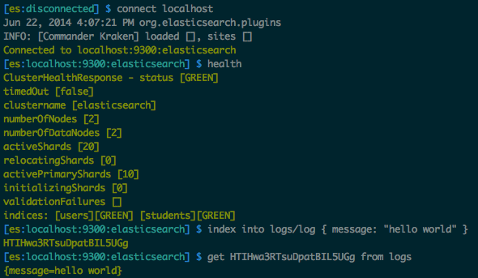
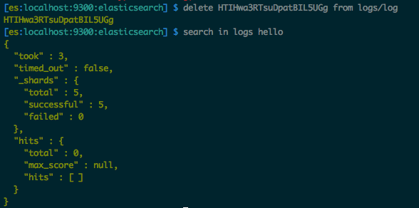

elasticsearch-repl
==================

Elasticsearch REPL built on top of Jest


## Installation
Download the latest release from releases. `es-repl` script is a shell script with a couple of jars embedded. Open a terminal and run `es-repl` by using the command below:

```
$ ./es-repl
```

## Available REPL commands

#### connect

Connects to a Elasticsearch cluster. Default host is `localhost` and default port is `9200`. You can also specify host and port information.

```
connect myhost
```

```
connect myanotherhost 9200
```

#### disconnect

Disconnects from the cluster.

#### health

Prints the health of the cluster.

#### count

Counts the documents in an index.

```
count users
```

```
counts users query
```

#### get

Gets a document with the given id.

```
get AU01vx8NLBXsJPBUOC5C from users
```

#### delete

Deletes a document with the given type and id.

```
delete AU01vx8NLBXsJPBUOC5C from users/user
```

#### search

Searchs for documents in an index.

```
search in users query
```

## Screenshots





